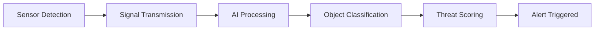

# sentinel-x-surveillance-system
# 🛰️ SENTINEL-X

### AI-Powered Multi-Node Defence Surveillance System

<p align="center">
  
  
  
</p>

---

## 🚀 Overview

SENTINEL-X is a **low-cost, AI-powered surveillance system** designed to intelligently detect, classify, and evaluate threats in real-time.

Unlike traditional systems, it doesn't just detect motion — it understands **what the threat is** and **how dangerous it is**.

---

## 🎯 Problem Statement

🔴 Traditional surveillance systems suffer from:

* High false alarm rates
* Inability to classify threats
* Expensive infrastructure
* Lack of intelligent decision-making

---

## 💡 Our Solution

✅ Multi-node surveillance system
✅ AI-based object detection
✅ Threat classification (Human, Drone, Animal)
✅ Real-time threat scoring

👉 Built as a **scalable and low-cost defence solution**

---

## 🎥 Demo

<p align="center">
  
</p>

👉 [Watch Full Demo Video](PASTE_YOUR_YOUTUBE_LINK_HERE)

---

## ⚙️ How It Works



---

## 🧠 Features

* 🔍 AI-based object detection
* ⚠️ Threat classification system
* 📊 Dynamic threat scoring
* 🔔 Real-time alert system
* 🌐 Scalable architecture
* 💻 Software-first prototype

---

## 🧩 System Architecture

<p align="center">
  
</p>

**Sensor Node (Simulated)** → **AI Node** → **Threat Analysis** → **Alert System**

---

## 🛠️ Tech Stack

* 🐍 Python
* 👁️ OpenCV
* 🌐 Flask
* 🤖 TensorFlow Lite / YOLO
* ☁️ Google Gemini API

---

## ☁️ Google Tech Integration

We leverage **Google Gemini API** to:

* Enhance threat reasoning
* Enable scalable cloud intelligence
* Support advanced decision-making

---

## 📊 Threat Scoring System

```text
Threat Score = Weight × Confidence × Distance Factor
```

| Threat | Level     |
| ------ | --------- |
| Drone  | 🔴 High   |
| Human  | 🟡 Medium |
| Animal | 🟢 Low    |

---

## 🌍 SDG Alignment

* 🏗️ **SDG 9** – Industry, Innovation & Infrastructure
* ⚖️ **SDG 16** – Peace, Justice & Strong Institutions

---

## 💰 Cost

* Prototype: ₹0 (software simulation)
* Full system: ~₹4500

👉 Designed for **affordability + scalability**

---

## 📸 Snapshots

<p align="center">
  
</p>

---

## 🔮 Future Scope

* Face recognition
* Drone-specific detection model
* Mobile dashboard
* GPS tracking
* Multi-node swarm system

---

## ⚠️ Note

This is a **software-first prototype** simulating hardware inputs.
It can be deployed on **Raspberry Pi + ESP32** in real-world environments.

---

## 👨‍💻 Team

**Team SENTINEL-X**
Google Solution Challenge 2026

---

## ⭐ If you like this project

Give it a ⭐ on GitHub!
